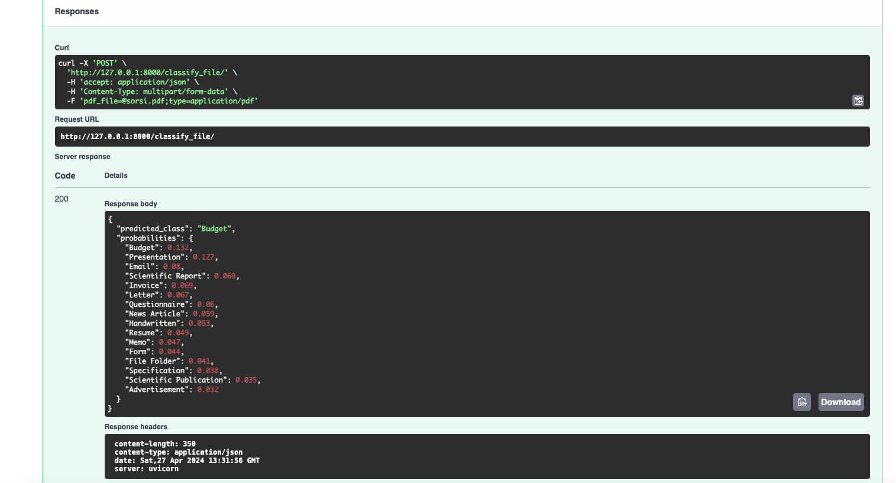
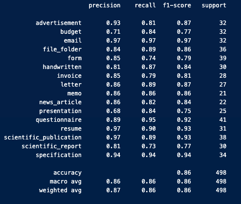

# Document Classifier with Fast API and LayoutLMv3

### Project description
This repository contains a simple Fast API application that classifies PDF documents to 16 classes (RVL-DCIP dataset target classes).
The classifier is a fine-tuned, multimodal LayoutLMv3 ([paper](https://arxiv.org/abs/2204.08387)) model. The fine-tuning steps are also available in the notebooks/ folder.

### Usage
1. Running the app.

    You can fork or clone the repository to run the code locally, or build your own Docker image. However, the built image is also available on[Docker Hub](https://hub.docker.com/r/davidhajdu1992/documentclassifier-app), making it even easier to use by simply pulling down the image and running it with docker-compose-run-app.yml file.

    **How to:**

    *Clone the repo. Start your Docker. Open a terminal and run the docker compose file with the following command: docker-compose -f ../path/docker-compose-run-app.yml up (set your own path to the file <- ../path/file.yml)*

2. Endpoints

    It's straightforward to demonstrate the app's features using Swagger when the app is running. As you can see on the image below there are only 2 endpoints in the application.
    

    **GET - classifier_model_details/**

    In this endpoint you can see the current HuggingFace model and tokenizer names that are in the application.
    

    **POST - classify_file/**

    In this endpoint, you can upload PDF files, and the model will attempt to classify them using the trained classes. (See the classes under the Model Fine-tuning section)
    
    On the following picture you can see the response format. The application returns the predicted class and an ordered dictionary of probabilities for each class, providing a useful and efficient way to assess the model's behavior in production.
    

### ML Pipeline
As the application itself the pipeline is also pretty simple and straightforward. In the demo example the user manually uploads a PDF file and that file will be processed and classified. 
1. Preprocessing

    Because LayoutLM is not an OCR-free model like [Donut](https://arxiv.org/abs/2111.15664) we have to extract the features from each PDF. LayoutLM uses [PyTessaract](https://pypi.org/project/pytesseract/) by default so I also used that for extracting the features from the images. As a first step we convert the PDF files to images using [pdf2image](https://pypi.org/project/pdf2image/) package. 

    *Side note: Why do I use PDF files instead of images if the OCR library expects images? Well, people commonly save their documents in PDF format. Therefore, I chose to use PDF files to ensure a realistic demonstration of how users interact with documents in real-world scenarios.*

    I could simple use [LayoutLMv3Processor](https://huggingface.co/docs/transformers/model_doc/layoutlmv3#transformers.LayoutLMv3Processor) for this in the application but for the sake of flexibility I thought it's better if I do manually step by step thus we can easily switch to [LiLT](https://arxiv.org/abs/2202.13669) or any other multimodal LLM if we want without overwriting the whole preprocessing part.

2. Inference and postprocessing

    During inference, we pass the encoded input values to the fine-tuned model. The model then returns logit values, which we map and convert into a human-readable format before displaying them in the application response.

### Model fine-tuning

1. Datasets

    Since there are limited free document datasets available my choices were constrained. Many document classification models use two primary benchmark datasets [RVL-DCIP](https://paperswithcode.com/dataset/rvl-cdip) and [Tobacco 3482](https://paperswithcode.com/dataset/tobacco-3482). RVL-DCIP contains 16 classes, 400K documents while Tobacco 3482 contains only 10 classes and 3482 documents. Both datasets contain old documents from 70s, 80s, 90s so the quality and the readibility is not comparable to the modern day documents. This is why fine-tuning a model on these datasets is quite challenging. I decided to use a random subset of RVL-DCIP that is available on [Kaggle](https://www.kaggle.com/datasets/shaz13/real-world-documents-collections). The subset contains 4992 images with all the 16 classes. (4977 were extracted others were defected)

    List of classes:

    - advertisement      
    - budget       
    - email      
    - file_folder       
    - form       
    - handwritten       
    - invoice       
    - letter       
    - memo       
    - news_article       
    - presentation       
    - questionnaire       
    - resume       
    - scientific_publication       
    - scientific_report       
    - specification    

2. Data preprocessing

    I made a train/eval/test split of the dataset. 
    - Train set: 3583 (stratified with eval)
    - Evaluation set: 896 (stratified with train)
    - Test set: 498 records (random sample not stratified)

    Then I converted the train and the eval dataset to Huggingface datasets. The train/eval datasets, the id2label, label2id dictionaries, and the pure labels list are available [here on Kaggle.](https://www.kaggle.com/datasets/hajdudavid/rvl-dcip-sample)
    The whole process is runable in the notebooks/1_preprocessing_train_data.ipynb jupyter notebook.

3. Fine-tuning the model

    Since I used a big multimodal LLM model I needed GPU source to be able to fine-tune the model. I ran the notebook on Kaggle with GPU4x2 resources and it took a little bit more than an hour. The whole process is available in notebooks/2_train_LayoutLM_v3_on_kaggle.ipynb notebook, but I pushed the trained model to my [HuggingFace Hub](https://huggingface.co/davidhajdu/fine-tuned-rvl-cdip). Also the metrics of the training is available under my [W & B profile](https://wandb.ai/david_hajdu/huggingface/runs/0bqlwuvd?nw=nwuserhajdudavid). In the paper of [LayoutLMv3](https://arxiv.org/abs/2204.08387) they mention of their approach of this task. Obviously when they fine-tuned the model they used the whole dataset 320K train, 40K evaluation and 40K test set. Their batch size was 64 while mine was only 16 since even 1 used kind of strong GPU but the memory capacity was limited to 16 GBs. Also they fine-tuned over 20K steps while I only trained the last layers over 960 steps.

4. Evaluation of the model

    Since the dataset that I used is small and challenging I didn't have high expectation with the performance of the model. Nonetheless, the accuracy score is 86% that is kinda acceptable but definetly not production ready.
    
    
    As you can see in the notebooks/3_eval_model_performance.ipynb notebook I used the previously saved dataset to evalute the performance. Unfortunetly with real-world/modern examples I haven't experience the same acceptable performance, as you can see above in this documentation the USAGE/ENDPOINTS/POST part on the image example the response of the model predicted 'BUDGET' class while the uploaded file is an invoice.

    